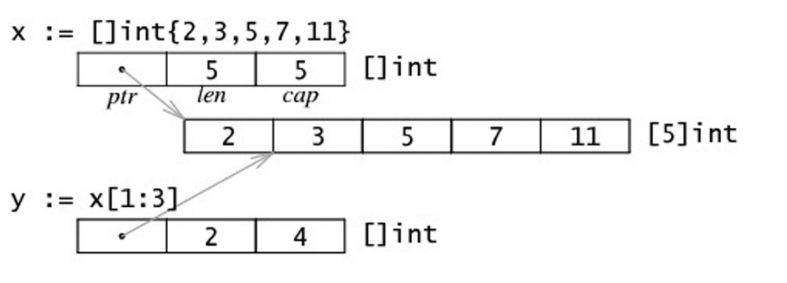

# Slice 詳解
> Slice 本身是個指針 適合用來傳遞大量的陣列使用 
> > 绝对不要用指针指向 slice
> > 绝对不要用指针指向 slice
> > 绝对不要用指针指向 slice


### 圖解


```go
func main() {
    var x [...]int{2, 3, 5, 7, 11}
    var slice1 [] int = x[1:3]

    //grow the slice
    
    slice1 = slice1[:4]
    for index := range slice1 {
       	fmt.Println(`Slice at `, index, `is`, slice1[index])
    }
}
```

由於slice 是一個指針類型的變數， slice 本身有len cap的參數要理解
> 筆者認為cap 是golang語言預設的長度 若 2^n 能解決就會用最小值n 
> 例如 長度為5 那就會尋找2^3 = 8 的cap長度 若長度只有4以下 則cap 則為4 cap長度與2次方有關係


### 增量

讓我覺得很有趣的事由於slice是指標的部分 只要len長度不超過cap 就能自動擴容 數值則參照pointer的參數做變動
